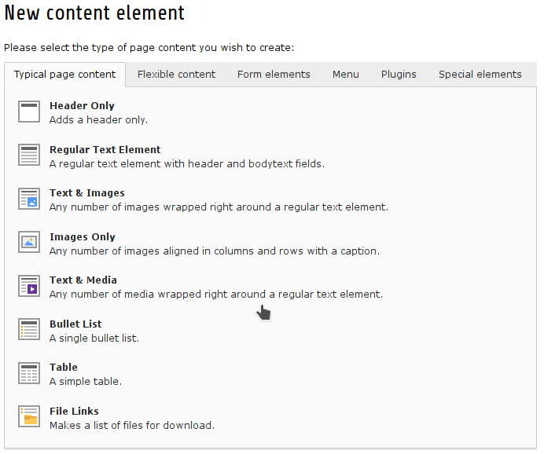

.. include:: ../Includes.txt
.. include:: Images.txt

New Content Element Wizard
--------------------------

    New content wizard in TYPO3 8 LTS

The content element wizard isn't new anymore. It is already integrated into the TYPO3 core. So the old documentation on
this point is outdated. Please take a look into the
`TYPO3 Page TSconfig <https://docs.typo3.org/typo3cms/TSconfigReference/PageTsconfig/Mod/Index.html#new-content-element-wizard-mod-wizards-newcontentelement>`_
documentation of TYPO3 core.

This documentation part will be removed in newer releases of TemplaVoilà! Plus.
